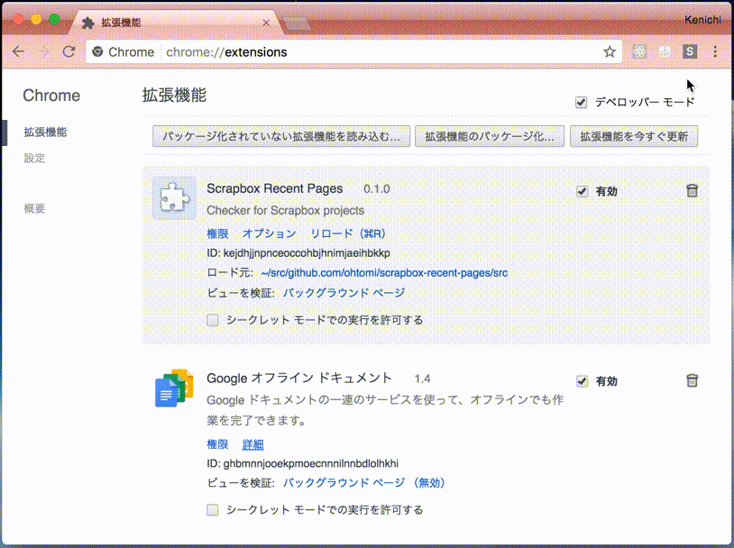
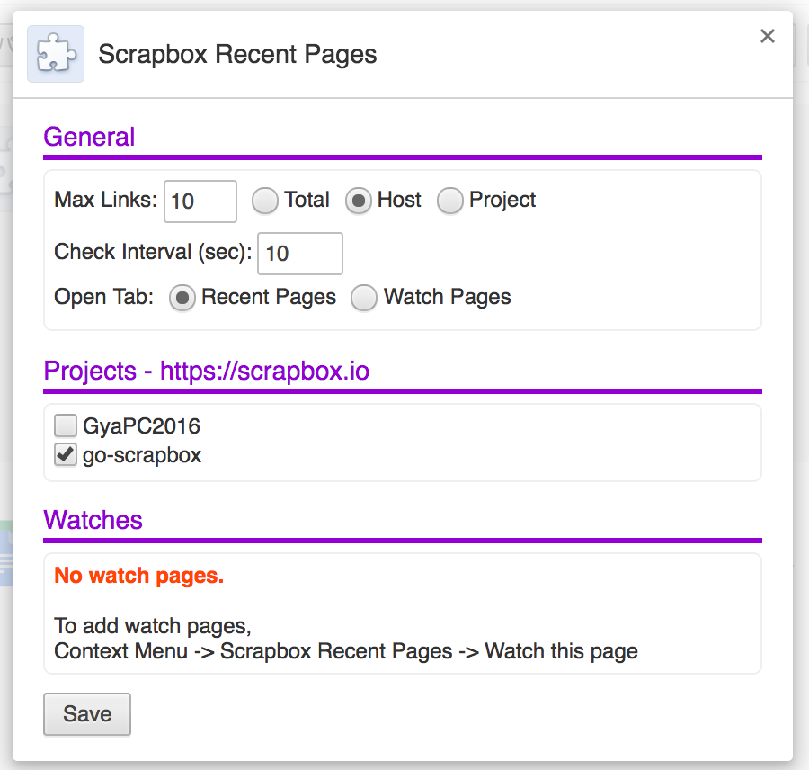

# scrapbox-recent-pages

This is a browser extension to watch Scrapbox pages.

## Usage





### Recent Pages

This tab shows links to recently updated pages of specified projects.

### Watch Pages

This tab shows links to unread pages that were updated after you had visited.

### Scrapbox Enterprise

To watch Scrapbox Enterprise, configure `src/manifest.json` and `src/settings.js`.

```json
{
  ...
  "permissions": [
    "https://scrapbox.io/*/*",
    "https://YOUR-HOST/*/*",
    "contextMenus",
    "storage",
    "cookies"
  ],
  ...
  "content_scripts": [
    {
      "matches": [
        "https://scrapbox.io/*",
        "https://YOUR-HOST/*"
      ],
      ...
    }
  ],
}
```

```javascript
class Settings {

    constructor(settings) {
        ...
        this.sites = settings.sites || [
            {baseUrl: 'https://scrapbox.io', projects: []},
            {baseUrl: 'https://YOUR-HOST', projects: []}
        ];
        ...
    }
    ...
};
```

## Install

To install, use `Load unpacked extension`.

## Contributing

1. Fork it!
1. Create your feature branch: `git checkout -b my-new-feature`
1. Commit your changes: `git commit -am 'Add some feature'`
1. Push to the branch: `git push origin my-new-feature`
1. Submit a pull request :D

## License

MIT

## Author

[Kenichi Ohtomi](https://github.com/ohtomi)
